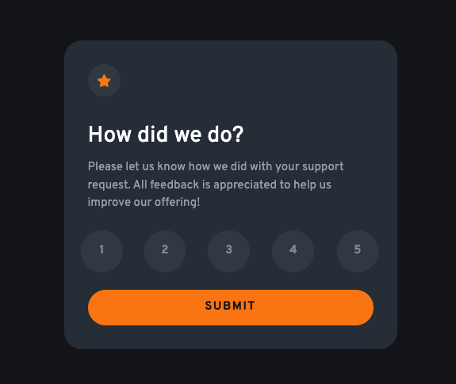
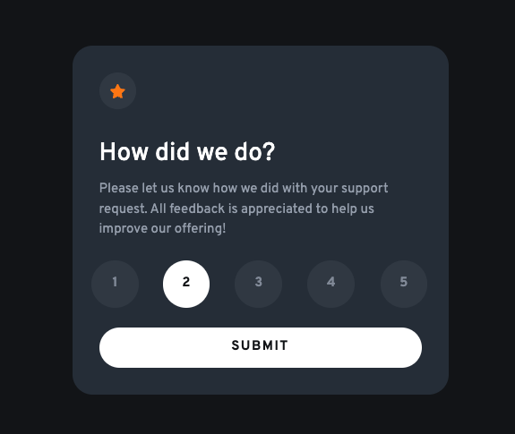
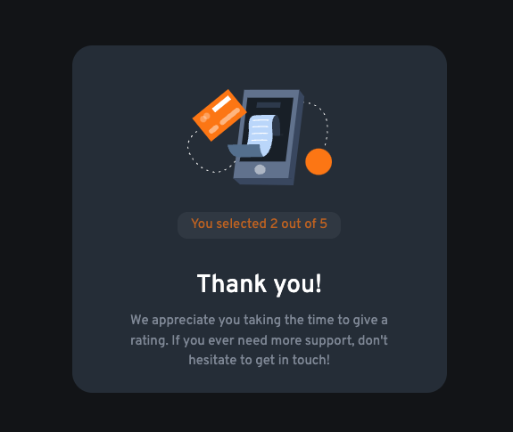

# Frontend Mentor - Interactive rating component solution

This is a solution to the [Interactive rating component challenge on Frontend Mentor](https://www.frontendmentor.io/challenges/interactive-rating-component-koxpeBUmI). Frontend Mentor challenges help you improve your coding skills by building realistic projects.

## Table of contents

- [Overview](#overview)
  - [The challenge](#the-challenge)
  - [Screenshots](#screenshots)
  - [Links](#links)
- [My process](#my-process)
  - [Built with](#built-with)
  - [What I learned](#what-i-learned)
  - [Continued development](#continued-development)
- [Author](#author)

## Overview

### The challenge

Users should be able to:

- View the optimal layout for the app depending on their device's screen size
- See hover states for all interactive elements on the page
- Select and submit a number rating
- See the "Thank you" card state after submitting a rating

### Screenshots





### Links

- Solution URL: [Add solution URL here](https://your-solution-url.com)
- Live Site URL: [Add live site URL here](https://your-live-site-url.com)

## My process

### Built with

- Semantic HTML5 markup
- [React](https://reactjs.org/) - JS library
- [Tailwind CSS](https://tailwindcss.com/) - For styles

### What I learned

I'm not sure if I set up the main container correctly. I used a fixed height so when a rating is submitted the card's height doesn't change.

````html
return (
    <div className="h-custom-26em relative m-4 max-w-md rounded-3xl bg-dark-blue p-8 text-white">
```

It took me a while to figure out how to make the semi-transparent circle work. I used relative and absolute positioning to achieve this. Next time I will try to use a different approach to make it work.

```html
<div className="flex justify-between">
          {[...Array(5).keys()].map((_, index) => {
            const value = index + 1;
            const isSelected = rating === value;
            return (
              <button
                key={index}
                className={`group relative mb-4 flex  items-center justify-center text-light-gray/80 `}
                onClick={() => handleRating(value)}
              >
                <span
                  className={`absolute mt-4 flex h-14 w-14 items-center justify-center rounded-full ${
                    isSelected ? "bg-white" : "bg-light-gray/10"
                  } group-hover:bg-orange`}
                ></span>
                <p
                  className={`relative z-10 mt-4 font-bold ${
                    isSelected
                      ? "text-very-dark-blue"
                      : "group-hover:text-very-dark-blue"
                  }`}
                >
                  {value}
                </p>
              </button>
````

### Continued development

I want to continue using React for state management.

## Author

- Frontend Mentor - [@justinsane](https://www.frontendmentor.io/profile/justinsane)
- X - [@just_levy](https://www.x.com/just_levy)
